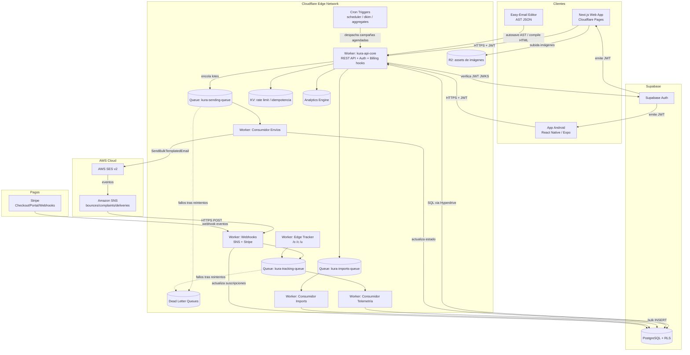
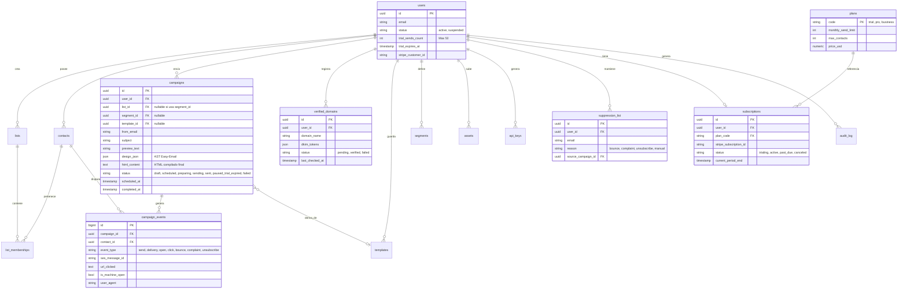
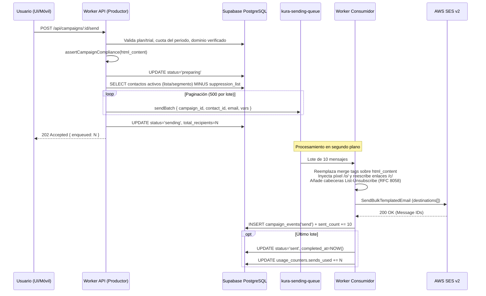
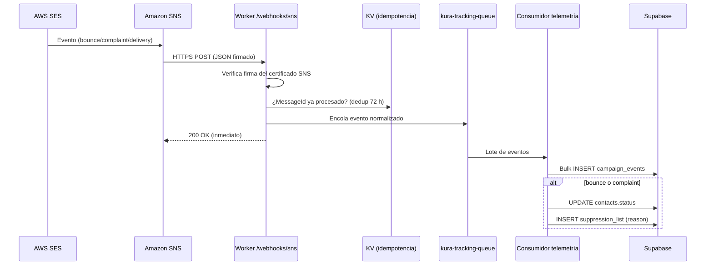
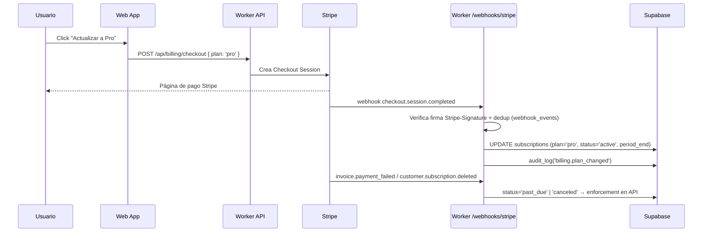
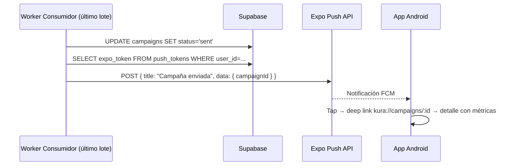

# KURA — Arquitectura Completa de la Plataforma SaaS

**Documento maestro de arquitectura — al 4 de octubre de 2026**

| Campo | Valor |
| :---- | :---- |
| Producto | KURA — Plataforma SaaS de campañas de email marketing |
| Repositorio | `github.com/horaciomartinez-svg/kura` (rama `main`) |
| Versión del documento | 3.0 (integra Arquitectura Web v1.0 + Actualización Easy-Email v2.0 + estado real del repositorio + extensiones SaaS profesionales + app móvil Android) |
| Alcance | Aplicación web (browser de escritorio), API Edge, motor de envíos, telemetría, facturación, seguridad, observabilidad y aplicación móvil Android |
| Documentos que reemplaza | "KURA Arquitectura de aplicación web.md" y "KURA actualización arquitectura con Easy-Email.md" |

---

## 1. Resumen Ejecutivo

KURA es una plataforma SaaS de email marketing construida bajo una **Arquitectura Orientada a Eventos (EDA) con microservicios serverless en el Edge**, diseñada para ofrecer escalabilidad masiva, latencia mínima y **costo de infraestructura casi cero en reposo** (modelo pay-per-use). El sistema permite a cada cliente (tenant) verificar su dominio de envío, gestionar listas de contactos, diseñar correos profesionales con un editor visual drag & drop basado en **Easy-Email** (open source, compilación MJML), enviar campañas masivas a través de **AWS SES** y medir aperturas, clics, rebotes y quejas en tiempo real mediante un **Tracking Engine en el Edge de Cloudflare**.

Decisiones arquitectónicas vigentes:

1. **Frontend web:** Next.js 14 (React 18) + TypeScript + Tailwind CSS, desplegado en Cloudflare Pages.
2. **Editor de correos:** Easy-Email (`easy-email-core`, `easy-email-editor`, `easy-email-extensions`) — se abandona el builder propio de bloques y se adopta el AST de Easy-Email como formato canónico de diseño.
3. **Backend:** Cloudflare Workers (API REST + productores/consumidores de colas + Edge Tracker + webhooks) orquestados con Cloudflare Queues, Cron Triggers, Hyperdrive, KV, R2 y Analytics Engine.
4. **Base de datos:** Supabase (PostgreSQL) con Row Level Security (RLS) para aislamiento multi-tenant y Supabase Auth para identidad.
5. **Infraestructura de envío:** AWS SES (salida) + Amazon SNS (eventos de entrega: bounces/complaints/deliveries).
6. **Facturación:** Stripe (Checkout + Customer Portal + Webhooks), con plan Trial limitado a 50 envíos y 7 días.
7. **App móvil Android:** React Native con Expo, cliente de monitoreo y gestión ligera que consume la misma API Edge y comparte los contratos TypeScript del paquete `@kura/core`.

---

## 2. Principios Arquitectónicos

| # | Principio | Aplicación en KURA |
| :-- | :---- | :---- |
| 1 | **Serverless-first / Zero idle cost** | Ningún servidor dedicado: Workers, Pages, Queues, Supabase y SES facturan por uso. Costo fijo mensual objetivo < USD 25 hasta los primeros ~5,000 usuarios. |
| 2 | **Edge computing** | Toda la lógica de request/response (API, tracking, redirects) corre en el punto de presencia Cloudflare más cercano al usuario o cliente de correo (< 50 ms p50). |
| 3 | **Asincronía por diseño** | Nada pesado ocurre dentro de una petición HTTP: envíos, imports de contactos, compilación y agregación de eventos fluyen por Cloudflare Queues con DLQ y reintentos. |
| 4 | **Separación AST / artefacto** | `campaigns.design_json` guarda el AST editable de Easy-Email; `campaigns.html_content` guarda el HTML compilado e inmutable que se envía. |
| 5 | **Multi-tenancy con aislamiento en DB** | Un solo esquema PostgreSQL compartido; aislamiento por `user_id` + políticas RLS. Sin bases por tenant (bajo costo operativo). |
| 6 | **Contratos compartidos** | `packages/core` es la fuente única de verdad de tipos TypeScript para web, móvil y workers. |
| 7 | **Cumplimiento por defecto** | CAN-SPAM, RFC 8058 (List-Unsubscribe one-click), GDPR/LOPDGDD, suppression lists y validación anti-spam integradas en el pipeline de envío, no como opción. |
| 8 | **Observabilidad barata** | Cloudflare Analytics Engine + Logpush + Sentry (free tier) + alertas a Slack/Discord/email. |
| 9 | **IaC y CI/CD desde el día uno** | Wrangler (TOML), migraciones SQL versionadas y GitHub Actions por workspace. |
| 10 | **Mobile como cliente, no como backend** | La app Android nunca implementa lógica de negocio: consume la API Edge con el mismo contrato y autenticación que la web. |

---

## 3. Estado Actual del Repositorio (snapshot 4-oct-2026)

Commit base: `fc089fb` — *"feat: initial commit with KURA monorepo architecture (Next.js + Cloudflare Workers)"*.

### 3.1 Implementado

| Componente | Ubicación | Estado |
| :---- | :---- | :---- |
| Monorepo npm workspaces | `package.json` raíz (`apps/*`, `packages/*`) | ✅ |
| Contratos compartidos (`TrialStatus`, `DomainVerificationState`, `QueuePayload`, `TrackingPayload`, etc.) | `packages/core/types.ts` | ✅ |
| Frontend Next.js 14 + Tailwind (paleta KURA, tipografías Clash Display/Inter) | `apps/web` | ✅ Base |
| Componentes UI: `MainDashboard`, `DomainVerificationPanel`, `CampaignBuilder` (builder propio: Canvas, LeftSidebar, BlockRenderer, TopBar) | `apps/web/src/components` | ✅ Base (builder propio será reemplazado por Easy-Email) |
| Store Zustand del editor | `apps/web/src/store/useCampaignBuilderStore.ts` | ✅ (a adaptar a AST Easy-Email) |
| Worker principal: router HTTP, CORS, dispatch de colas | `apps/api-workers/src/index.ts` | ✅ |
| Productor de envíos `POST /api/campaigns/:id/send` (encolado por lotes, lógica de DB aún simulada) | `apps/api-workers/src/handlers/sendCampaign.ts` | ⚠️ Funcional con mocks de DB |
| Guardado de diseño `PUT /api/campaigns/:id/design` | `apps/api-workers/src/handlers/saveDesign.ts` | ⚠️ Base |
| Consumidor de envíos (batch de 10, `SendBulkTemplatedEmail`, `ackAll/retryAll`) | `apps/api-workers/src/queues/emailConsumer.ts` | ⚠️ Compilación MJML pendiente de migrar a artefacto HTML pre-compilado |
| Edge Tracker `/o/:payload.gif` y `/c/:payload` (píxel 1x1, redirect 302, detección AMPP/bots, `ctx.waitUntil`) | `apps/api-workers/src/tracking/index.ts` | ✅ |
| Consumidor de telemetría (bulk INSERT a `campaign_events`) | `apps/api-workers/src/queues/trackingConsumer.ts` | ⚠️ Pendiente parametrización SQL segura |
| Esquema relacional inicial (users, verified_domains, lists, contacts, list_memberships, campaigns, campaign_events) | `apps/api-workers/src/db/schema.sql` | ✅ (se amplía en §7) |
| Configuración Workers/Queues/DLQ | `apps/api-workers/wrangler.toml` | ✅ (Hyperdrive comentado para dev local) |
| CI/CD GitHub Actions (deploy web + api-workers con typecheck) | `.github/workflows/web.yml`, `api-workers.yml` | ✅ |

### 3.2 Brechas identificadas que este documento cierra

1. **Autenticación y multi-tenancy real** (hoy no existe auth ni RLS).
2. **Migración del CampaignBuilder propio a Easy-Email** (decisión ya tomada, falta especificación completa).
3. **Webhooks de Amazon SNS** (bounces/complaints/deliveries) — hoy solo hay tracking de opens/clicks.
4. **Suppression list global** y gestión de bajas (List-Unsubscribe / RFC 8058).
5. **Facturación** (Stripe) y enforcement del Trial en backend.
6. **Almacenamiento de imágenes** del editor (Cloudflare R2) vía `onUploadImage`.
7. **Envíos programados** (Cron Triggers), importación CSV masiva, segmentos, plantillas.
8. **Seguridad de API**: verificación de JWT, rate limiting, CORS restrictivo, firma de payloads de tracking (HMAC).
9. **Observabilidad**: Analytics Engine, Sentry, alertas de reputación (bounce rate > 2%).
10. **Arquitectura de la app móvil Android**.
11. **Entornos** (dev/staging/prod), gestión de secretos, backups y DR.

---

## 4. Stack Tecnológico Consolidado

| Capa | Tecnología | Justificación |
| :---- | :---- | :---- |
| **Frontend Web** | Next.js 14 (App Router) + React 18 + TypeScript | SSR/SSG, ecosistema del editor Easy-Email, despliegue en Cloudflare Pages. |
| **Estilos UI** | Tailwind CSS 3.4 + `@tailwindcss/forms` | Implementación exacta del design system KURA (radios 6–8px, sombras sutiles). |
| **Editor de correos** | Easy-Email (`easy-email-core` + `easy-email-editor` + `easy-email-extensions`) + `mjml-browser` | Editor open source maduro: AST JSON → MJML → HTML responsive compatible con clientes de correo. Elimina el riesgo de mantener un builder propio. |
| **Estado cliente (web)** | Zustand + TanStack Query | Zustand para estado efímero del editor/UI; TanStack Query para caché y sincronización con la API. |
| **Gráficos web** | Recharts | KPIs del dashboard (AreaChart con gradiente #AFFECA). |
| **App móvil Android** | React Native 0.74+ con Expo SDK 51+ (EAS Build) | Comparte TypeScript y `@kura/core` con la web; OTA updates con EAS Update; push via Expo Notifications/FCM. |
| **API Backend** | Cloudflare Workers (router propio ligero o Hono) | Latencia Edge, costo por request, integración nativa con Queues/KV/R2/Cron. |
| **Colas** | Cloudflare Queues (sending, tracking, imports, events) + DLQ | Absorbe picos masivos; `max_batch_size` alineado a límites de SES. |
| **Tareas programadas** | Cloudflare Cron Triggers | Despacho de campañas `scheduled`, re-verificación DKIM, agregaciones nocturnas. |
| **Base de datos** | Supabase (PostgreSQL 15) + Drizzle ORM | Integridad referencial multi-tenant, RLS, Realtime opcional, backups/PITR. |
| **Conexión DB desde Edge** | Cloudflare Hyperdrive | Pooling TCP y caché de conexiones hacia Supabase (evita agotar conexiones Postgres desde Workers). |
| **Auth** | Supabase Auth (email/password + magic link + OAuth Google) | JWT verificable en Workers con la clave pública (JWKS); gratuito hasta 50k MAU. |
| **Envío de correo** | AWS SES v2 (`SendBulkTemplatedEmail` / `SendEmail`) | USD 0.10 por 1,000 correos; reputación y configuración DKIM por dominio. |
| **Eventos de entrega** | Amazon SNS → HTTPS webhook → Worker | Bounces, complaints, deliveries, rejects alimentan suppression list y métricas. |
| **Almacenamiento de imágenes** | Cloudflare R2 + dominio público/CDN | Cero costo de egreso; integración con `onUploadImage` de Easy-Email. |
| **Caché y rate limiting** | Cloudflare KV + Workers (token bucket por usuario/IP) | Control de abuso de API y deduplicación de eventos. |
| **Métricas de plataforma** | Cloudflare Analytics Engine | Series temporales baratas para KPIs internos (envíos por tenant, RPS, errores). |
| **Facturación** | Stripe (Checkout, Customer Portal, Webhooks) | Sin costo fijo; comisión por transacción. Planes Trial/Pro/Business. |
| **Errores y APM** | Sentry (SDK Workers + Next.js + Expo) | Free tier suficiente para MVP; trazas de colas y frontend. |
| **Emails transaccionales de plataforma** | AWS SES (identidad propia `kura.app`) | Reset password, alertas de trial, notificación de campaña completada. |
| **CI/CD** | GitHub Actions + Wrangler + Cloudflare Pages + EAS | Deploy por workspace con typecheck, migraciones y despliegue móvil. |

---

## 5. Arquitectura Global

### 5.1 Diagrama de alto nivel (Mermaid)



### 5.2 Flujo de datos por operación crítica

| Operación | Ruta | Latencia objetivo |
| :---- | :---- | :---- |
| Guardar diseño (autosave AST) | Web → Worker API → Supabase | < 300 ms |
| Compilar y guardar HTML | Web (compila en cliente con mjml-browser) → Worker API → Supabase | < 800 ms |
| Enviar campaña (N contactos) | Web → API (valida trial/plan/compliance) → encola N mensajes → 202 | < 1 s (respuesta) |
| Entrega real | Consumidor → SES bulk (lotes de 10) | Ritmo controlado por `max_batch_size` y concurrencia |
| Open/Click | Cliente correo → Edge Tracker → respuesta inmediata + evento a cola | < 50 ms p50 |
| Bounce/Complaint | SES → SNS → Worker webhook → cola → DB + suppression list | < 5 s |
| Cobro / cambio de plan | Stripe → webhook → DB (subscriptions) → enforcement en API | < 5 s |

---

## 6. Estructura del Monorepo (objetivo)

```plaintext
kura-monorepo/
├── apps/
│   ├── web/                          # Next.js 14 (Cloudflare Pages)
│   │   ├── src/
│   │   │   ├── app/                  # App Router
│   │   │   │   ├── (auth)/           # login, register, reset-password
│   │   │   │   ├── dashboard/
│   │   │   │   ├── campaigns/        # listado + detalle + builder
│   │   │   │   ├── contacts/         # listas, contactos, segmentos, imports
│   │   │   │   ├── domains/
│   │   │   │   ├── billing/
│   │   │   │   └── settings/
│   │   │   ├── components/
│   │   │   │   ├── CampaignBuilder/  # Wrapper Easy-Email (ver §9)
│   │   │   │   ├── MainDashboard.tsx
│   │   │   │   ├── DomainVerificationPanel.tsx
│   │   │   │   └── ...
│   │   │   ├── store/                # Zustand
│   │   │   ├── hooks/                # TanStack Query hooks
│   │   │   └── lib/                  # api client, supabase client, utils
│   │   └── tailwind.config.ts
│   ├── mobile/                       # NUEVO: React Native + Expo (ver §13)
│   │   ├── src/
│   │   │   ├── screens/              # Dashboard, Campaigns, CampaignDetail, Contacts, Settings
│   │   │   ├── components/
│   │   │   ├── navigation/
│   │   │   ├── lib/                  # api client (comparte contratos @kura/core)
│   │   │   └── store/
│   │   ├── app.json
│   │   └── eas.json
│   └── api-workers/                  # Cloudflare Workers
│       ├── src/
│       │   ├── index.ts              # Router + queue consumers + cron
│       │   ├── middleware/           # auth (JWT), rateLimit, cors, errors
│       │   ├── handlers/             # campaigns, contacts, lists, segments,
│       │   │                         # domains, billing, templates, assets, unsubscribe
│       │   ├── queues/               # emailConsumer, trackingConsumer, importConsumer
│       │   ├── tracking/             # Edge tracker /o /c /u
│       │   ├── webhooks/             # snsEvents.ts, stripeEvents.ts
│       │   ├── cron/                 # scheduler.ts, dkimVerifier.ts, aggregator.ts
│       │   ├── services/             # ses.ts, suppression.ts, compliance.ts
│       │   ├── db/                   # client.ts (Hyperdrive+Drizzle), schema.sql, migrations/
│       │   └── types/                # env.d.ts
│       └── wrangler.toml
├── packages/
│   ├── core/                         # Tipos y contratos compartidos (web, mobile, workers)
│   │   ├── types.ts
│   │   ├── api.ts                    # Contratos request/response de la API REST
│   │   └── index.ts
│   └── config/                       # tsconfig bases, eslint, tailwind preset
└── .github/workflows/                # web.yml, api-workers.yml, mobile.yml, db-migrations.yml
```

---

## 7. Diseño de Datos (PostgreSQL / Supabase)

El modelo separa contactos globales de membresías a listas, incorpora el esquema Easy-Email (AST + HTML compilado) y añade las entidades necesarias para un SaaS profesional: planes y suscripciones, suppression list, segmentos, plantillas, assets, eventos de webhook, claves API y auditoría. Todas las tablas tenant llevan `user_id` y están protegidas con **Row Level Security**.

### 7.1 Diagrama Entidad-Relación (Mermaid)



### 7.2 Script DDL completo (objetivo)

> El archivo `apps/api-workers/src/db/schema.sql` del repositorio se reemplaza por migraciones versionadas en `apps/api-workers/src/db/migrations/` (`0001_init.sql`, `0002_easy_email.sql`, `0003_saas.sql`, `0004_rls.sql`…). A continuación el esquema consolidado resultante.

```sql
CREATE EXTENSION IF NOT EXISTS "uuid-ossp";
CREATE EXTENSION IF NOT EXISTS pgcrypto;

-- ============================== IDENTIDAD ==================================
-- users.id referencia auth.users.id de Supabase Auth (1:1).
CREATE TABLE users (
    id UUID PRIMARY KEY,                      -- = auth.users.id
    email VARCHAR(255) UNIQUE NOT NULL,
    full_name VARCHAR(200),
    status VARCHAR(50) DEFAULT 'active' CHECK (status IN ('active', 'suspended')),
    trial_sends_count INT DEFAULT 0 CHECK (trial_sends_count <= 50),
    trial_expires_at TIMESTAMPTZ NOT NULL DEFAULT (NOW() + INTERVAL '7 days'),
    stripe_customer_id VARCHAR(255),
    locale VARCHAR(10) DEFAULT 'es',
    timezone VARCHAR(64) DEFAULT 'America/Santiago',
    created_at TIMESTAMPTZ DEFAULT NOW()
);

-- ============================== PLANES / BILLING ===========================
CREATE TABLE plans (
    code VARCHAR(50) PRIMARY KEY,             -- 'trial', 'pro', 'business'
    name VARCHAR(100) NOT NULL,
    monthly_send_limit INT NOT NULL,          -- trial: 50, pro: 10000, business: 100000
    max_contacts INT NOT NULL,                -- trial: 100, pro: 5000, business: 50000
    max_domains INT NOT NULL DEFAULT 1,
    price_usd NUMERIC(10,2) NOT NULL DEFAULT 0,
    stripe_price_id VARCHAR(255),
    features JSONB DEFAULT '{}'::jsonb
);

CREATE TABLE subscriptions (
    id UUID PRIMARY KEY DEFAULT uuid_generate_v4(),
    user_id UUID NOT NULL REFERENCES users(id) ON DELETE CASCADE,
    plan_code VARCHAR(50) NOT NULL REFERENCES plans(code),
    stripe_subscription_id VARCHAR(255) UNIQUE,
    status VARCHAR(50) NOT NULL DEFAULT 'trialing'
        CHECK (status IN ('trialing','active','past_due','canceled','incomplete')),
    current_period_start TIMESTAMPTZ,
    current_period_end TIMESTAMPTZ,
    cancel_at_period_end BOOLEAN DEFAULT FALSE,
    created_at TIMESTAMPTZ DEFAULT NOW(),
    updated_at TIMESTAMPTZ DEFAULT NOW()
);

CREATE TABLE usage_counters (                 -- enforcement de cuotas por periodo
    user_id UUID NOT NULL REFERENCES users(id) ON DELETE CASCADE,
    period_start DATE NOT NULL,
    sends_used INT NOT NULL DEFAULT 0,
    contacts_count INT NOT NULL DEFAULT 0,
    updated_at TIMESTAMPTZ DEFAULT NOW(),
    PRIMARY KEY (user_id, period_start)
);

-- ============================== DOMINIOS ===================================
CREATE TABLE verified_domains (
    id UUID PRIMARY KEY DEFAULT uuid_generate_v4(),
    user_id UUID NOT NULL REFERENCES users(id) ON DELETE CASCADE,
    domain_name VARCHAR(255) NOT NULL,
    dkim_tokens JSONB NOT NULL,               -- tokens CNAME de SES Easy DKIM
    spf_record TEXT,                          -- include:amazonses.com
    dmarc_record TEXT,                        -- v=DMARC1; p=quarantine...
    status VARCHAR(50) DEFAULT 'pending' CHECK (status IN ('pending','verified','failed')),
    last_checked_at TIMESTAMPTZ,
    created_at TIMESTAMPTZ DEFAULT NOW(),
    UNIQUE(user_id, domain_name)
);

-- ============================== AUDIENCIAS =================================
CREATE TABLE lists (
    id UUID PRIMARY KEY DEFAULT uuid_generate_v4(),
    user_id UUID NOT NULL REFERENCES users(id) ON DELETE CASCADE,
    name VARCHAR(255) NOT NULL,
    description TEXT,
    created_at TIMESTAMPTZ DEFAULT NOW()
);

CREATE TABLE contacts (
    id UUID PRIMARY KEY DEFAULT uuid_generate_v4(),
    user_id UUID NOT NULL REFERENCES users(id) ON DELETE CASCADE,
    email VARCHAR(255) NOT NULL,
    first_name VARCHAR(100),
    last_name VARCHAR(100),
    custom_fields JSONB DEFAULT '{}'::jsonb,  -- atributos variables por tenant
    status VARCHAR(50) DEFAULT 'active'
        CHECK (status IN ('active','bounced','unsubscribed','complained')),
    consent_source VARCHAR(100),              -- trazabilidad GDPR: form, import, api
    consent_at TIMESTAMPTZ,
    created_at TIMESTAMPTZ DEFAULT NOW(),
    updated_at TIMESTAMPTZ DEFAULT NOW(),
    UNIQUE(user_id, email)
);

CREATE TABLE list_memberships (
    list_id UUID NOT NULL REFERENCES lists(id) ON DELETE CASCADE,
    contact_id UUID NOT NULL REFERENCES contacts(id) ON DELETE CASCADE,
    joined_at TIMESTAMPTZ DEFAULT NOW(),
    PRIMARY KEY (list_id, contact_id)
);

CREATE TABLE segments (                        -- segmentación dinámica por reglas
    id UUID PRIMARY KEY DEFAULT uuid_generate_v4(),
    user_id UUID NOT NULL REFERENCES users(id) ON DELETE CASCADE,
    name VARCHAR(255) NOT NULL,
    rules JSONB NOT NULL,                      -- [{field, operator, value}, ...]
    cached_count INT DEFAULT 0,
    created_at TIMESTAMPTZ DEFAULT NOW()
);

CREATE TABLE suppression_list (                -- nunca enviar a estos correos
    id UUID PRIMARY KEY DEFAULT uuid_generate_v4(),
    user_id UUID NOT NULL REFERENCES users(id) ON DELETE CASCADE,
    email VARCHAR(255) NOT NULL,
    reason VARCHAR(50) NOT NULL CHECK (reason IN ('bounce','complaint','unsubscribe','manual')),
    source_campaign_id UUID,
    created_at TIMESTAMPTZ DEFAULT NOW(),
    UNIQUE(user_id, email)
);

-- ============================== CONTENIDO ==================================
CREATE TABLE templates (                       -- biblioteca de plantillas reutilizables
    id UUID PRIMARY KEY DEFAULT uuid_generate_v4(),
    user_id UUID REFERENCES users(id) ON DELETE CASCADE,  -- NULL = plantilla global KURA
    name VARCHAR(255) NOT NULL,
    thumbnail_url TEXT,
    design_json JSONB NOT NULL,                -- AST Easy-Email
    category VARCHAR(100),
    is_global BOOLEAN DEFAULT FALSE,
    created_at TIMESTAMPTZ DEFAULT NOW()
);

CREATE TABLE assets (                          -- imágenes subidas al editor (R2)
    id UUID PRIMARY KEY DEFAULT uuid_generate_v4(),
    user_id UUID NOT NULL REFERENCES users(id) ON DELETE CASCADE,
    r2_key TEXT NOT NULL,
    public_url TEXT NOT NULL,
    content_type VARCHAR(100),
    size_bytes INT,
    created_at TIMESTAMPTZ DEFAULT NOW()
);

-- ============================== CAMPAÑAS ===================================
CREATE TABLE campaigns (
    id UUID PRIMARY KEY DEFAULT uuid_generate_v4(),
    user_id UUID NOT NULL REFERENCES users(id) ON DELETE CASCADE,
    list_id UUID REFERENCES lists(id) ON DELETE SET NULL,
    segment_id UUID REFERENCES segments(id) ON DELETE SET NULL,
    template_id UUID REFERENCES templates(id) ON DELETE SET NULL,
    name VARCHAR(255) NOT NULL,
    from_name VARCHAR(255),
    from_email VARCHAR(255) NOT NULL,
    reply_to VARCHAR(255),
    subject VARCHAR(255),
    preview_text VARCHAR(255),
    design_json JSONB,                         -- AST Easy-Email (estado editable)
    html_content TEXT,                         -- HTML compilado final (artefacto inmutable)
    status VARCHAR(50) DEFAULT 'draft' CHECK (status IN
        ('draft','scheduled','preparing','sending','sent','paused_trial_expired','failed','canceled')),
    scheduled_at TIMESTAMPTZ,
    started_at TIMESTAMPTZ,
    completed_at TIMESTAMPTZ,
    total_recipients INT DEFAULT 0,
    sent_count INT DEFAULT 0,
    created_at TIMESTAMPTZ DEFAULT NOW(),
    updated_at TIMESTAMPTZ DEFAULT NOW(),
    CHECK (list_id IS NOT NULL OR segment_id IS NOT NULL OR status = 'draft')
);

-- Tabla de eventos de alto volumen: candidata a particionar por mes (created_at).
CREATE TABLE campaign_events (
    id BIGINT GENERATED ALWAYS AS IDENTITY,
    campaign_id UUID NOT NULL REFERENCES campaigns(id) ON DELETE CASCADE,
    contact_id UUID NOT NULL REFERENCES contacts(id) ON DELETE CASCADE,
    event_type VARCHAR(50) NOT NULL CHECK (event_type IN
        ('send','delivery','open','click','bounce','complaint','unsubscribe')),
    ses_message_id VARCHAR(255),
    url_clicked TEXT,
    is_machine_open BOOLEAN DEFAULT FALSE,
    user_agent TEXT,
    created_at TIMESTAMPTZ DEFAULT NOW(),
    PRIMARY KEY (id, created_at)
);

-- Agregados por campaña para dashboard rápido (actualizado por trigger/cron).
CREATE TABLE campaign_stats (
    campaign_id UUID PRIMARY KEY REFERENCES campaigns(id) ON DELETE CASCADE,
    sends INT DEFAULT 0,
    deliveries INT DEFAULT 0,
    unique_opens INT DEFAULT 0,
    total_opens INT DEFAULT 0,
    unique_clicks INT DEFAULT 0,
    total_clicks INT DEFAULT 0,
    bounces INT DEFAULT 0,
    complaints INT DEFAULT 0,
    unsubscribes INT DEFAULT 0,
    updated_at TIMESTAMPTZ DEFAULT NOW()
);

-- ============================== PLATAFORMA =================================
CREATE TABLE api_keys (                        -- API pública futura / integraciones
    id UUID PRIMARY KEY DEFAULT uuid_generate_v4(),
    user_id UUID NOT NULL REFERENCES users(id) ON DELETE CASCADE,
    name VARCHAR(100) NOT NULL,
    key_hash TEXT NOT NULL,                    -- sha256 de la clave (nunca en claro)
    scopes TEXT[] DEFAULT '{read}',
    last_used_at TIMESTAMPTZ,
    created_at TIMESTAMPTZ DEFAULT NOW(),
    revoked_at TIMESTAMPTZ
);

CREATE TABLE webhook_events (                  -- idempotencia de SNS y Stripe
    id UUID PRIMARY KEY DEFAULT uuid_generate_v4(),
    provider VARCHAR(50) NOT NULL,             -- 'sns' | 'stripe'
    external_id VARCHAR(255) NOT NULL,
    payload JSONB NOT NULL,
    processed_at TIMESTAMPTZ DEFAULT NOW(),
    UNIQUE(provider, external_id)
);

CREATE TABLE audit_log (
    id BIGINT GENERATED ALWAYS AS IDENTITY PRIMARY KEY,
    user_id UUID REFERENCES users(id) ON DELETE SET NULL,
    action VARCHAR(100) NOT NULL,              -- 'campaign.send', 'domain.verify', ...
    entity_type VARCHAR(50),
    entity_id UUID,
    metadata JSONB DEFAULT '{}'::jsonb,
    ip VARCHAR(45),
    created_at TIMESTAMPTZ DEFAULT NOW()
);

-- ============================== ÍNDICES ====================================
CREATE INDEX idx_contacts_user_status   ON contacts(user_id, status);
CREATE INDEX idx_contacts_user_email    ON contacts(user_id, email);
CREATE INDEX idx_campaigns_user_status  ON campaigns(user_id, status);
CREATE INDEX idx_campaigns_scheduled    ON campaigns(scheduled_at) WHERE status = 'scheduled';
CREATE INDEX idx_events_campaign_type   ON campaign_events(campaign_id, event_type);
CREATE INDEX idx_events_created         ON campaign_events(created_at);
CREATE INDEX idx_suppression_user_email ON suppression_list(user_id, email);
CREATE INDEX idx_memberships_contact    ON list_memberships(contact_id);
```

### 7.3 Row Level Security (aislamiento multi-tenant)

Los Workers se conectan con el **service role** vía Hyperdrive y aplican el `user_id` extraído del JWT verificado. Aun así, RLS actúa como segunda línea de defensa (defense in depth) y habilita en el futuro acceso directo desde el cliente con Supabase JS.

```sql
ALTER TABLE contacts ENABLE ROW LEVEL SECURITY;

CREATE POLICY contacts_tenant_isolation ON contacts
    USING (user_id = auth.uid())
    WITH CHECK (user_id = auth.uid());

-- Patrón idéntico para: lists, list_memberships (vía join), campaigns,
-- campaign_events, verified_domains, segments, templates, assets,
-- suppression_list, subscriptions, api_keys.
```

### 7.4 Vista de métricas del dashboard

```sql
CREATE VIEW v_dashboard_metrics AS
SELECT
    c.user_id,
    COUNT(DISTINCT CASE WHEN e.event_type = 'delivery' THEN e.contact_id END) AS delivered,
    COUNT(DISTINCT CASE WHEN e.event_type = 'open' AND NOT e.is_machine_open
                        THEN e.contact_id END) AS unique_opens,
    COUNT(DISTINCT CASE WHEN e.event_type = 'click' THEN e.contact_id END) AS unique_clicks,
    COUNT(CASE WHEN e.event_type = 'bounce' THEN 1 END) AS bounces,
    COUNT(CASE WHEN e.event_type = 'complaint' THEN 1 END) AS complaints
FROM campaigns c
LEFT JOIN campaign_events e ON e.campaign_id = c.id
WHERE e.created_at > NOW() - INTERVAL '30 days'
GROUP BY c.user_id;
```

---

## 8. Backend Edge (Cloudflare Workers)

### 8.1 Mapa de la API REST

Base URL: `https://api.kura.app` (Worker `kura-api-core`). Todas las rutas `/api/*` exigen JWT de Supabase Auth salvo las marcadas como públicas.

| Método | Ruta | Descripción | Auth |
| :---- | :---- | :---- | :---- |
| POST | `/api/auth/register` | Registro (delega en Supabase Auth) + crea fila en `users` y `subscriptions(trial)` | Pública |
| GET | `/api/me` | Perfil, estado de trial, plan y uso del periodo | JWT |
| GET/POST | `/api/domains` · `/api/domains/:id/verify` | Alta de dominio, emisión de registros DKIM/SPF/DMARC, verificación | JWT |
| GET/POST/PUT/DELETE | `/api/lists`, `/api/lists/:id` | CRUD de listas | JWT |
| GET/POST/PUT/DELETE | `/api/contacts`, `/api/contacts/:id` | CRUD de contactos (con dedup por email) | JWT |
| POST | `/api/contacts/import` | Importación CSV masiva (encola a `kura-imports-queue`) | JWT |
| GET/POST | `/api/segments` | CRUD de segmentos + `POST /:id/preview` (conteo) | JWT |
| GET/POST | `/api/templates` | Biblioteca de plantillas (globales + propias) | JWT |
| GET/POST/PUT/DELETE | `/api/campaigns`, `/api/campaigns/:id` | CRUD de campañas | JWT |
| PATCH | `/api/campaigns/:id/autosave` | Guarda `design_json` (AST) sin compilar | JWT |
| PUT | `/api/campaigns/:id/compile` | Guarda AST + `html_content` compilado | JWT |
| POST | `/api/campaigns/:id/send` | Envío inmediato (valida trial/cuota/compliance) → 202 | JWT |
| POST | `/api/campaigns/:id/schedule` | Agendamiento (`scheduled_at`) para el Cron dispatcher | JWT |
| POST | `/api/campaigns/:id/test` | Envío de prueba a ≤ 5 direcciones del propio usuario | JWT |
| GET | `/api/campaigns/:id/stats` | Métricas agregadas (desde `campaign_stats`) | JWT |
| GET | `/api/dashboard/metrics` | KPIs últimos 30 días | JWT |
| POST | `/api/assets` | Subida de imagen a R2 (multipart) → `public_url` | JWT |
| GET | `/api/billing/portal` · POST `/api/billing/checkout` | Stripe Customer Portal / Checkout Session | JWT |
| POST | `/webhooks/sns` | Eventos SES (bounce/complaint/delivery) — firma SNS | Pública (firma SNS) |
| POST | `/webhooks/stripe` | Eventos Stripe — firma `Stripe-Signature` | Pública (firma Stripe) |
| GET | `/o/:payload.gif` · `/c/:payload` · `/u/:payload` | Tracking open, click y unsubscribe one-click | Pública |
| GET | `/health` | Healthcheck para monitoreo externo | Pública |

### 8.2 Middleware transversal

```plaintext
Request → CORS restrictivo (origins: app.kura.app, localhost:3000)
        → Rate limit (KV token bucket: 300 req/min por usuario, 60 req/min por IP anónima)
        → Auth (verificación JWT Supabase vía JWKS; extrae user_id)
        → Idempotency-Key (opcional, KV 24h) en POST sensibles
        → Handler → respuesta con { data } | { error: { code, message } }
```

Cambio respecto al código actual: el `Access-Control-Allow-Origin: *` de `index.ts` se restringe a los orígenes oficiales antes de producción.

### 8.3 `wrangler.toml` consolidado (objetivo)

```toml
name = "kura-api-core"
main = "src/index.ts"
compatibility_date = "2024-03-20"

[vars]
ENVIRONMENT = "production"
AWS_REGION = "us-east-1"
MAX_TRIAL_SENDS = 50
APP_ORIGIN = "https://app.kura.app"

# ---- Cola de envíos ----
[[queues.producers]]
queue = "kura-sending-queue"
binding = "SENDING_QUEUE"

[[queues.consumers]]
queue = "kura-sending-queue"
max_batch_size = 10           # alineado a SendBulkTemplatedEmail
max_batch_timeout = 5
max_retries = 3
dead_letter_queue = "kura-dlq"

# ---- Cola de telemetría (opens/clicks + eventos SNS) ----
[[queues.producers]]
queue = "kura-tracking-queue"
binding = "TRACKING_QUEUE"

[[queues.consumers]]
queue = "kura-tracking-queue"
max_batch_size = 100
max_batch_timeout = 5
max_retries = 3
dead_letter_queue = "kura-tracking-dlq"

# ---- Cola de importación de contactos ----
[[queues.producers]]
queue = "kura-imports-queue"
binding = "IMPORTS_QUEUE"

[[queues.consumers]]
queue = "kura-imports-queue"
max_batch_size = 25
max_batch_timeout = 30
max_retries = 3
dead_letter_queue = "kura-imports-dlq"

# ---- Cron: despachador de campañas agendadas + agregación + re-verify DKIM ----
[triggers]
crons = ["* * * * *", "*/15 * * * *", "17 * * * *"]
#   minuto a minuto: scheduler de campañas (status='scheduled' AND scheduled_at <= now)
#   cada 15 min:     re-verificación de dominios pendientes
#   horario :17:     agregación de campaign_stats y usage_counters

# ---- KV: rate limiting, idempotencia, cache JWKS ----
[[kv_namespaces]]
binding = "KURA_KV"
id = "kura-kv-prod"

# ---- R2: assets de imágenes del editor ----
[[r2_buckets]]
binding = "KURA_ASSETS"
bucket_name = "kura-assets"

# ---- Analytics Engine: métricas internas ----
[[analytics_engine_datasets]]
binding = "KURA_ANALYTICS"
dataset = "kura_platform_metrics"

# ---- Hyperdrive -> Supabase PostgreSQL (producción) ----
[[hyperdrive]]
binding = "DB_POOL"
id = "kura-supabase-pool-id"
```

### 8.4 Envíos programados (Cron dispatcher)

```typescript
// apps/api-workers/src/cron/scheduler.ts
export async function dispatchScheduledCampaigns(env: Env): Promise<void> {
  const db = getDb(env);
  const due = await db.query(
    `SELECT id FROM campaigns
     WHERE status = 'scheduled' AND scheduled_at <= NOW()
     ORDER BY scheduled_at LIMIT 50`
  );
  for (const { id } of due.rows) {
    await enqueueCampaign(id, env); // misma rutina del handler /send
  }
}
```

---

## 9. Editor de Correos con Easy-Email (decisión vigente)

Se adopta **Easy-Email** (open source, MIT) como motor del CampaignBuilder, reemplazando el builder propio (`Canvas.tsx`, `LeftSidebar.tsx`, `BlockRenderer.tsx` quedan deprecados y se eliminan en el sprint de migración). La librería aporta el árbol AST, drag & drop, panel de atributos y compilación MJML probada, reduciendo el riesgo de desarrollo y la carga de cómputo en el Edge.

### 9.1 Modelo de datos del editor

| Campo | Contenido | Momento de escritura |
| :---- | :---- | :---- |
| `campaigns.design_json` | AST Easy-Email (`type: 'page'`, children) | Autosave (debounce 30 s) vía `PATCH /autosave` |
| `campaigns.html_content` | HTML final compilado (MJML → HTML, modo production) | Botón "Guardar y continuar" vía `PUT /compile` |

**Regla de oro:** el Worker consumidor de envíos **nunca compila MJML**; solo personaliza merge tags sobre `html_content` ya compilado. Esto reduce CPU en el Edge (límite de 10–50 ms por request en Workers) y elimina una clase entera de fallos en caliente.

### 9.2 Dependencias a añadir en `apps/web/package.json`

```json
{
  "dependencies": {
    "easy-email-core": "^4.x",
    "easy-email-editor": "^4.x",
    "easy-email-extensions": "^4.x",
    "mjml-browser": "^4.15.3"
  }
}
```

### 9.3 Theming KURA sobre Easy-Email

| Propiedad Easy-Email | Configuración KURA | Comportamiento |
| :---- | :---- | :---- |
| `theme.color.primary` | `#014751` (Verde Esmeralda) | Botones primarios del editor y bordes de bloques activos |
| `theme.background.canvas` | `#F7F9FC` (Gris Hielo) | Fondo envolvente fuera de la hoja de 600 px |
| `mergeTags` (Provider) | First Name, Last Name, Email, Unsubscribe URL | Inyecta `{{contact.first_name}}`, `{{contact.last_name}}`, `{{contact.email}}`, `{{unsubscribe_url}}` en el panel de texto |
| `onUploadImage` | API propia `POST /api/assets` | Subida asíncrona a Cloudflare R2 y retorno de URL pública CDN |
| Bloques extendidos (`easy-email-extensions`) | Product block oculto en MVP; Social, Video y Countdown habilitados | Editor rico sin costo de desarrollo |

### 9.4 Flujo de persistencia en el cliente

```typescript
// apps/web/src/components/CampaignBuilder/useEasyEmailPersistence.ts
import { transformToMjml } from 'easy-email-core';
import mjml2html from 'mjml-browser';

// 1. Auto-guardado del AST (debounced 30 s)
const autoSave = useDebounce(async (currentAST: EasyEmailAST) => {
  await api.patch(`/api/campaigns/${id}/autosave`, { design_json: currentAST });
}, 30_000);

// 2. Compilación final (botón "Guardar y continuar")
const handleFinalSave = async (currentAST: EasyEmailAST) => {
  const mjmlString = transformToMjml({ data: currentAST, mode: 'production' });
  const { html, errors } = mjml2html(mjmlString, { validationLevel: 'soft' });
  if (errors.length) notifyMjmlWarnings(errors);
  await api.put(`/api/campaigns/${id}/compile`, {
    design_json: currentAST,
    html_content: html,
  });
};
```

### 9.5 Validación de cumplimiento en backend (obligatoria)

```typescript
// apps/api-workers/src/services/compliance.ts
export function assertCampaignCompliance(html: string | null): void {
  if (!html || !html.includes('{{unsubscribe_url}}')) {
    throw new ApiError(422, 'COMPLIANCE_ERROR',
      'La campaña debe incluir la variable {{unsubscribe_url}} (normativa anti-spam).');
  }
  if (html.length > 102 * 1024) { // Gmail corta correos > 102 KB
    throw new ApiError(422, 'HTML_TOO_LARGE',
      'El HTML supera 102 KB y Gmail lo recortaría.');
  }
}
// Se invoca en /send, /schedule y /test antes de cambiar el estado.
```

---

## 10. Motor Asíncrono de Envíos

Componente crítico del MVP. Productor-Consumidor sobre Cloudflare Queues con control de ritmo alineado a los límites de AWS SES (14 emails/seg en sandbox; configurable según la cuota de producción de la cuenta AWS).

### 10.1 Diagrama de secuencia



### 10.2 Contrato de la cola (actualizado en `packages/core/types.ts`)

```typescript
export interface QueuePayload {
  campaignId: string;
  contactId: string;
  contactEmail: string;
  contactVars: Record<string, string>;  // merge tags: nombre, apellido, custom_fields
  fromEmail: string;
  fromName: string;
  replyTo?: string;
  subject: string;
  unsubscribeToken: string;             // token firmado HMAC para /u/:payload
  batchSeq: number;                     // para detectar el último lote
  batchTotal: number;
}
```

> Nota de diseño: `html_content` **no viaja en el mensaje** (los mensajes de Queues tienen límite de ~128 KB). El consumidor lo lee una vez por lote desde Supabase con caché en KV (`campaign:html:{id}`, TTL 1 h).

### 10.3 Robustez del consumidor

| Riesgo | Mitigación |
| :---- | :---- |
| Error transitorio de SES (throttling, red) | `batch.retryAll()` → hasta 3 reintentos con backoff de Queues |
| Error permanente | Mensaje a `kura-dlq` + alerta Sentry + evento `audit_log` |
| Envíos duplicados tras retry | Clave de idempotencia `campaign_id:contact_id` en `campaign_events` (índice único parcial sobre `event_type='send'`) |
| Exceder cuota SES/segundo | `max_batch_size=10`, `max_batch_timeout=5` y `max_concurrency` del consumidor ajustado a la cuota SES de la cuenta |
| Bounce rate alto durante envío | Guardián de reputación (§12.4): pausa automática de la campaña |

---

## 11. Telemetría Edge y Eventos de Entrega (SNS)

### 11.1 Edge Tracker (opens / clicks / unsubscribe)

Se mantiene la implementación actual (`apps/api-workers/src/tracking/index.ts`) con dos endurecimientos:

1. **Payload firmado (HMAC-SHA256)** en lugar de Base64 puro: `payload = base64url(json).signature`. Evita que terceros forjen eventos o enumeren campañas/contactos.
2. **Unsubscribe one-click (RFC 8058):** ruta `GET|POST /u/:payload` que marca al contacto como `unsubscribed`, inserta en `suppression_list` y muestra una página de confirmación mínima. Los correos incluyen las cabeceras:
   ```
   List-Unsubscribe: <https://api.kura.app/u/{payload}>, <mailto:unsubscribe@{dominio}>
   List-Unsubscribe-Post: List-Unsubscribe=One-Click
   ```
   (Obligatorio para remitentes masivos en Gmail/Yahoo desde feb-2024.)

Detección de aperturas máquina vigente: `User-Agent` con `CFNetwork` (Apple MPP), `Barracuda`, `Mimecast`, `Proofpoint` → `is_machine_open = true`, excluidas de las tasas del dashboard.

### 11.2 Webhook de Amazon SNS (bounces / complaints / deliveries)



Reglas de clasificación: `bounce.bounceType = Permanent` → contacto a `bounced` + suppression; `Transient` repetido 3 veces → igual tratamiento; `complaint` → `complained` + suppression inmediata (obligatorio para conservar la cuenta SES).

### 11.3 Consumidor de telemetría — corrección de seguridad pendiente

El `trackingConsumer.ts` actual construye SQL por interpolación de strings. Debe migrarse a **consultas parametrizadas** (Drizzle `insert().values([...])`) antes de exponerlo a tráfico real. Es la corrección de seguridad prioritaria nº 1 del backlog.

### 11.4 Guardián de reputación

Job del consumidor de telemetría: si una campaña en curso supera **bounce rate > 5%** o **complaint rate > 0.1%** (umbrales de AWS), se actualiza la campaña a `paused_trial_expired`/`failed`, se notifica al usuario (email + push) y se registra en `audit_log`. A nivel plataforma, bounce rate global > 2% dispara la tarjeta de alerta ámbar/roja del Dashboard.

---

## 12. Autenticación, Multi-tenancy y Facturación

### 12.1 Autenticación (Supabase Auth)

| Aspecto | Decisión |
| :---- | :---- |
| Proveedor | Supabase Auth (GoTrue): email+password, magic link y OAuth Google |
| Token | JWT (RS256/ES256) emitido por Supabase; el Worker lo verifica con el JWKS público cacheado en KV (TTL 1 h) — sin llamada de red por request |
| Sesión web | Cookies `httpOnly` + refresh token manejado por `@supabase/ssr` en Next.js |
| Sesión móvil | `expo-secure-store` para access/refresh tokens; renovación silenciosa |
| Onboarding | Registro → trigger DB crea fila en `users` + `subscriptions(plan=trial)` + `trial_expires_at = NOW() + 7 días` |

### 12.2 Multi-tenancy

- **Modelo:** silo compartido (una DB, una tabla por entidad, discriminador `user_id`).
- **Aislamiento:** RLS en todas las tablas tenant + `user_id` inyectado por el middleware de auth en el Worker (nunca desde el body del cliente).
- **Límites por tenant:** `plans` + `usage_counters` verificados en `/send`, `/contacts/import` y `/domains` (POST).

### 12.3 Facturación con Stripe

| Plan | Precio sugerido | Límites |
| :---- | :---- | :---- |
| **Trial** | USD 0 (7 días) | 50 envíos totales, 100 contactos, 1 dominio |
| **Pro** | USD 19/mes | 10,000 envíos/mes, 5,000 contactos, 3 dominios |
| **Business** | USD 49/mes | 100,000 envíos/mes, 50,000 contactos, 10 dominios, API keys |



- **Sin UI de pago propia:** Stripe Checkout + Customer Portal (cambio de tarjeta, cancelación, facturas). Cumplimiento PCI delegado a Stripe.
- **Proration:** gestionada por Stripe al cambiar de plan.
- **Trial → pago:** el soft-lock del día 8+ (ver guía UI) lleva a Checkout; si paga, `subscriptions.status='active'` y el banner desaparece.

### 12.4 Cumplimiento y entregabilidad

| Norma / mecanismo | Implementación en KURA |
| :---- | :---- |
| CAN-SPAM / leyes anti-spam | `{{unsubscribe_url}}` obligatorio (§9.5), dirección física del remitente en footer (merge tag `{{sender_address}}` obligatorio) |
| RFC 8058 (one-click) | Cabeceras `List-Unsubscribe` + `List-Unsubscribe-Post` en cada correo |
| Gmail/Yahoo sender rules | DKIM (Easy DKIM de SES, 3 CNAME), SPF `include:amazonses.com`, DMARC `p=quarantine` mínimo; verificación guiada en `DomainVerificationPanel` |
| GDPR / LOPDGDD | `consent_source` + `consent_at` en contactos, exportación y borrado de datos del contacto (derecho de supresión), DPA con Supabase/AWS |
| Suppression list | Global por tenant: bounces, complaints, unsubscribes y bajas manuales excluidas de todo envío futuro |
| Validación de emails en import | Regex + verificación MX (DNS) en el import consumer; opcionalmente servicio de verificación externo en fase 2 |
| Reputación | Guardián automático (§11.4), alertas de bounce > 2%, warm-up recomendado por dominio nuevo |

### 12.5 Almacenamiento de imágenes (Cloudflare R2)

- Bucket `kura-assets` con dominio público `cdn.kura.app` (caché Cloudflare, egreso gratis).
- `POST /api/assets` (multipart, máx. 5 MB, tipos `image/png|jpeg|gif|webp`) → clave `assets/{user_id}/{uuid}.{ext}` → URL pública inmutable.
- Integración con `onUploadImage` de Easy-Email: el editor sube y recibe la URL sin salir del canvas.
- Limpieza: assets huérfanos (no referenciados por ningún `design_json`) se purgan en el cron nocturno.

---

## 13. Aplicación Móvil Android

### 13.1 Decisión tecnológica

**React Native 0.74+ con Expo SDK 51+** dentro del mismo monorepo (`apps/mobile`):

- Comparte lenguaje (TypeScript), contratos (`@kura/core`), cliente API y lógica de formateo con la web.
- Una sola base de código produce la app Android (y deja iOS habilitado a futuro sin costo adicional de arquitectura).
- **EAS Build** compila APK/AAB en la nube (sin necesidad de Mac ni granjas CI propias); **EAS Update** permite OTA de JS sin pasar por Play Store para fixes menores.
- Costo: plan gratuito de Expo/EAS es suficiente para el MVP; Google Play Console tiene costo único de USD 25.

### 13.2 Alcance funcional de la app (v1)

La app móvil es un **cliente de monitoreo y gestión ligera**, no un editor: diseñar correos drag & drop sigue siendo experiencia de escritorio.

| Pantalla | Funciones |
| :---- | :---- |
| Login / Registro | Email+password y Google (Supabase Auth, `expo-secure-store`) |
| Dashboard | Las 4 tarjetas KPI (suscriptores, open rate, CTR, rebotes con alerta > 2%) + AreaChart (vía `victory-native` o `react-native-gifted-charts`) |
| Campañas | Lista con badges de estado, barra de progreso de aperturas, pull-to-refresh |
| Detalle de campaña | Métricas (enviados, entregados, aperturas únicas/totales, clics, rebotes, quejas), gráfico temporal, enlace "ver en web" para editar |
| Contactos | Conteo por lista, búsqueda simple, estado de suscripción (solo lectura en v1) |
| Alertas | Push notifications: campaña completada, campaña pausada por reputación, trial por expirar (día 5-7), pago fallido |
| Configuración | Perfil, estado del plan/trial, cerrar sesión |

### 13.3 Arquitectura técnica móvil

```plaintext
apps/mobile/
├── src/
│   ├── navigation/        # expo-router (stack + tabs: Dashboard, Campañas, Contactos, Ajustes)
│   ├── screens/
│   ├── components/        # MetricCard, CampaignRow, StatusBadge (mismo lenguaje visual KURA)
│   ├── lib/
│   │   ├── api.ts         # fetch client con JWT (mismos endpoints que la web)
│   │   ├── auth.ts        # Supabase Auth + expo-secure-store
│   │   └── push.ts        # Expo Push Tokens → tabla push_tokens
│   ├── store/             # Zustand (sesión, filtros)
│   └── theme/             # paleta KURA portada a StyleSheet tokens
├── app.json               # slug, icon, splash (#014751), scheme kura://
└── eas.json               # perfiles: development, preview (APK), production (AAB)
```

| Concern | Solución |
| :---- | :---- |
| Estado servidor | TanStack Query (misma librería que web; caché + revalidación) |
| Gráficos | `react-native-gifted-charts` (ligero) con gradiente #AFFECA |
| Push notifications | Expo Notifications → FCM; el token se registra en `push_tokens(user_id, token)` y el backend emite push al completar campañas o disparar el guardián de reputación |
| Offline | Caché de TanStack Query en `AsyncStorage` (solo lectura de últimas métricas) |
| Deep links | `kura://campaigns/:id` abre el detalle desde la notificación push |
| Actualizaciones | EAS Update (OTA) para JS/assets; EAS Build + Play Console para binarios |

### 13.4 Nueva tabla de soporte

```sql
CREATE TABLE push_tokens (
    id UUID PRIMARY KEY DEFAULT uuid_generate_v4(),
    user_id UUID NOT NULL REFERENCES users(id) ON DELETE CASCADE,
    expo_token VARCHAR(255) NOT NULL,
    platform VARCHAR(20) DEFAULT 'android',
    created_at TIMESTAMPTZ DEFAULT NOW(),
    UNIQUE(user_id, expo_token)
);
```

### 13.5 Flujo de notificación de campaña completada



---

## 14. Seguridad

| Capa | Medida |
| :---- | :---- |
| Transporte | TLS 1.3 extremo a extremo (Cloudflare); HSTS estricto |
| Autenticación API | JWT Supabase verificado en Edge (JWKS cacheado en KV); expiración corta + refresh |
| Autorización | `user_id` siempre del token, nunca del payload; RLS como segunda barrera |
| SQL | 100% consultas parametrizadas vía Drizzle ORM (corrige la interpolación actual del tracking consumer) |
| Secretos | `wrangler secret` para `AWS_ACCESS_KEY_ID/SECRET`, `STRIPE_SECRET_KEY`, `STRIPE_WEBHOOK_SECRET`, `SUPABASE_SERVICE_ROLE_KEY`, `TRACKING_HMAC_SECRET`; nunca en `wrangler.toml` ni en Git |
| Webhooks | Verificación de firma SNS (certificado X.509) y Stripe (`Stripe-Signature`); idempotencia con `webhook_events` |
| Tracking URLs | Payload con HMAC-SHA256 anti-falsificación |
| Rate limiting | Token bucket en KV por usuario/IP; límites más estrictos en `/auth/*` y `/send` |
| CORS | Orígenes explícitos (`https://app.kura.app`, builds de desarrollo) |
| Uploads | Validación MIME real (magic bytes), tamaño máx. 5 MB, claves R2 no adivinables (UUID) |
| Headers web | CSP, `X-Frame-Options: DENY`, `Referrer-Policy`, `Permissions-Policy` vía `_headers` de Cloudflare Pages |
| Auditoría | `audit_log` para acciones sensibles (envíos, cambios de plan, verificación de dominio, bajas masivas) |
| Datos personales | Cifrado en reposo (Supabase), retención configurable de `campaign_events` (13 meses por defecto), derecho de supresión GDPR |

---

## 15. Observabilidad y Operación

| Señal | Herramienta | Detalle |
| :---- | :---- | :---- |
| Errores backend/frontend/móvil | Sentry (3 proyectos) | Free tier; source maps en CI; alertas a email/Slack |
| Métricas de plataforma | Cloudflare Analytics Engine | Envíos/hora, RPS API, tamaño de colas, tasa de error por endpoint |
| Logs | Workers Logpush → R2 (o tail en dev) | Retención 30 días |
| Métricas de negocio | `campaign_stats` + vista `v_dashboard_metrics` | Agregación por cron horario |
| Salud del sistema | Check externo (Better Stack / UptimeRobot free) sobre `/health` | Alerta en < 1 min si la API cae |
| Reputación de envío | Panel propio (bounce/complaint rate por tenant y global) + alertas del guardián (§11.4) | Umbral ámbar 2% / rojo 5% bounces |
| DLQ | Revisión programada (cron) + alerta si `kura-dlq` > 0 mensajes | Reprocesamiento manual vía script `wrangler` |

---

## 16. Entornos, CI/CD y Calidad

### 16.1 Entornos

| Entorno | Frontend | Workers | Base de datos |
| :---- | :---- | :---- | :---- |
| dev | `localhost:3000` | `wrangler dev` + `.dev.vars` | Supabase proyecto dev / branch |
| staging | Preview de Cloudflare Pages (por PR) | Worker `kura-api-staging` | Supabase proyecto staging |
| prod | `app.kura.app` | `kura-api-core` | Supabase producción (PITR habilitado) |

### 16.2 Pipelines (GitHub Actions)

| Workflow | Trigger | Pasos |
| :---- | :---- | :---- |
| `web.yml` (existente) | push a `main` en `apps/web/**` | install → typecheck → build → deploy Pages |
| `api-workers.yml` (existente) | push a `main` en `apps/api-workers/**`, `packages/core/**` | install → typecheck → tests → `wrangler deploy` |
| `mobile.yml` (nuevo) | tag `mobile-v*` o manual | `eas build --platform android --profile production` + submit a Play Console |
| `db-migrations.yml` (nuevo) | push en `apps/api-workers/src/db/migrations/**` | aplica migraciones con `supabase db push` (staging → prod con aprobación manual) |

### 16.3 Estrategia de pruebas

| Nivel | Herramienta | Cobertura prioritaria |
| :---- | :---- | :---- |
| Unitarios | Vitest | compliance (anti-spam), merge tags, firma/verificación HMAC, clasificación de bounces |
| Integración | Vitest + `@cloudflare/vitest-pool-workers` | handlers con bindings simulados (Queues, KV, Hyperdrive) |
| Contrato | Tipos `@kura/core` compilados en los 3 targets (web, mobile, workers) en CI | Drift de contratos = build roto |
| E2E | Playwright (web) | flujo feliz: login → dominio → lista → campaña Easy-Email → test send |
| Carga | k6 contra staging | `/o/` y `/c/` a 5k RPS; envío de campaña de 50k contactos simulados |

---

## 17. Estimación de Costos (bajo costo por diseño)

| Servicio | Capa gratuita | Costo esperado MVP (≤ 1M correos/mes) |
| :---- | :---- | :---- |
| Cloudflare Workers | 100k req/día | USD 5/mes (plan paid) si se supera |
| Cloudflare Queues | 1M operaciones/mes incluidas en plan paid | ~USD 0–4 |
| Cloudflare R2 | 10 GB + egreso gratis | USD 0 |
| Cloudflare Pages / KV / Analytics Engine | Generoso | USD 0 |
| Supabase | 500 MB DB, 50k MAU auth (free) | USD 0 → USD 25/mes (Pro) al crecer |
| AWS SES | — | USD 0.10 / 1,000 correos → USD 100 por 1M |
| AWS SNS | 1M publicaciones gratis | USD 0 |
| Stripe | Sin fijo | 2.9% + USD 0.30 por cobro |
| Expo EAS | Free tier (builds limitados) | USD 0 → USD 29/mes si se requiere más concurrencia |
| Sentry | 5k eventos/mes | USD 0 |
| Google Play | — | USD 25 único |
| **Total fijo mensual (arranque)** | | **≈ USD 5–30/mes + costo variable de SES** |

---

## 18. Roadmap por Fases

| Fase | Contenido | Criterio de salida |
| :---- | :---- | :---- |
| **F0 — Fundaciones (hecho)** | Monorepo, contratos, CI/CD, tracking Edge, colas, esquema base | Commit `fc089fb` |
| **F1 — MVP funcional** | Supabase Auth + RLS, Drizzle+Hyperdrive reales (eliminar mocks), migración Easy-Email, assets R2, compliance + unsubscribe, fix SQL parametrizado | Envío E2E real de campaña con métricas en dashboard |
| **F2 — SaaS comercial** | Stripe (checkout/portal/webhooks), enforcement de cuotas, suppression list + SNS bounces/complaints, envíos programados (cron), importación CSV, plantillas | Primer cliente pagando en producción |
| **F3 — App Android v1** | `apps/mobile` con Expo: auth, dashboard, campañas, push notifications, EAS Build → Play Console (internal → producción) | App publicada en Google Play |
| **F4 — Crecimiento** | Segmentos dinámicos, A/B testing, automatizaciones (journeys), API pública con `api_keys`, webhooks salientes, app iOS (mismo codebase RN) | Retención y expansión de cuentas |

---

## 19. Anexo A — Guía de Estilo UI/UX (vigente, sin cambios)

Minimalismo vibrante con alta legibilidad; esquinas de 6–8 px.

| Elemento | Especificación | Uso |
| :---- | :---- | :---- |
| Primario | Verde Esmeralda `#014751` | Acciones principales, estado verificado, líneas de gráficos |
| Acento | Verde Menta `#AFFECA` | Alertas sutiles, rellenos de gráficos, hover, bordes de dropzones |
| Fondo | Gris Hielo `#F7F9FC` | Fondo de app y canvas del editor |
| Texto/Oscuros | Gris Carbón `#111827` | Tipografía general, top banner de trial |
| Tipografía títulos | Clash Display | KPIs, marca, modales |
| Tipografía cuerpo | Inter | Tablas, formularios, listas |
| Bordes/sombras | `rounded-md`–`rounded-xl`, sombra `0 4px 6px rgba(0,0,0,0.05)` | Tarjetas y paneles |

Pantallas de referencia: **Dashboard** (4 KPI cards — Rebotes > 2% en ámbar/rojo; AreaChart con gradiente menta; tabla de campañas con badge de estado y barra de progreso), **DomainVerificationPanel** (alerta educativa sobre sufijos GoDaddy/Namecheap, valores DNS monoespaciados, copiado con botón → check verde), **Editor** (Easy-Email themeado, canvas 600 px, autosave 30 s), **Paywall Trial** (banner oscuro días 5–7; día 8+ botones al 50% de opacidad + modal con blur y CTA "Actualizar a Pro").

## 20. Anexo B — Contratos TypeScript vigentes (`packages/core`)

Se mantienen íntegros los contratos del repositorio (`TrialStatus`, `DomainVerificationState`, `DnsRecord`, `CampaignBuilderState` — *deprecado tras migración Easy-Email*, `QueuePayload` — *extendido en §10.2*, `TrackingPayload`, `CampaignEventType` — *extendido con `send|delivery|unsubscribe`*), más los añadidos por la actualización Easy-Email:

```typescript
export interface EasyEmailAST {
  type: 'page';
  data: { value: Record<string, any> };
  children: any[];
}

export interface CampaignSaveRequest {
  design_json: EasyEmailAST;
}

export interface CampaignCompileRequest extends CampaignSaveRequest {
  html_content: string; // HTML final compilado en el cliente (mjml-browser)
}
```

Y los nuevos contratos de plataforma:

```typescript
export type PlanCode = 'trial' | 'pro' | 'business';

export interface SubscriptionStatus {
  plan: PlanCode;
  status: 'trialing' | 'active' | 'past_due' | 'canceled' | 'incomplete';
  sendsUsed: number;
  sendsLimit: number;
  periodEnd: string; // ISO 8601
  isLocked: boolean;
}

export interface CampaignStats {
  campaignId: string;
  sends: number;
  deliveries: number;
  uniqueOpens: number;
  totalOpens: number;
  uniqueClicks: number;
  totalClicks: number;
  bounces: number;
  complaints: number;
  unsubscribes: number;
}

export interface ApiError {
  error: { code: string; message: string };
}
```

---

*Fin del documento. Fuente de verdad arquitectónica de KURA al 4 de octubre de 2026; prevalece sobre los documentos v1.0 y v2.0 que integra.*
